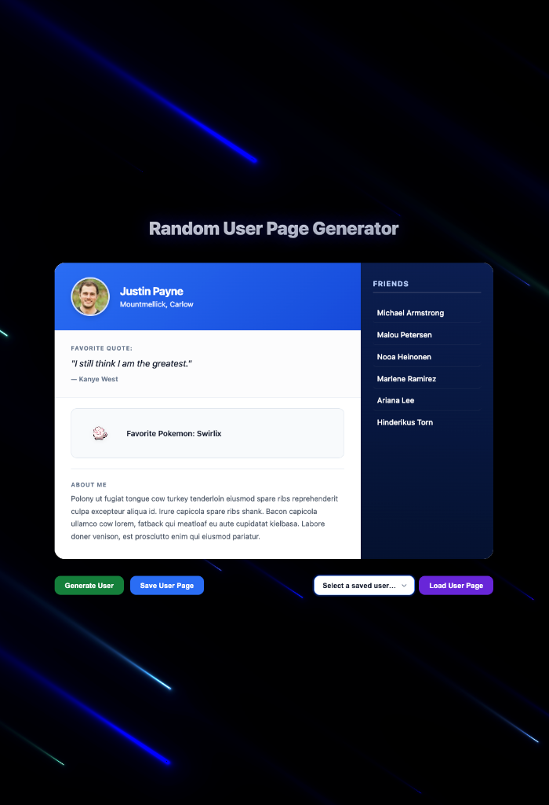

# Random User Page Generator (RUPG)

A premium, modern social-style profile page that pulls live data from four public APIs and renders a unique user on every click, set against a beautiful animated WebGL shader background.

## Preview



## What It Does

On load — and each time you click **Generate User** — the app fetches data from four APIs simultaneously and builds a complete profile: photo, full name, location, a Kanye West quote, a random Pokémon, a bacon-ipsum bio, and a friends list.

Profiles can be saved to `localStorage` and reloaded at any time from the dropdown.

## Visual & Technical Enhancements Added

- **Animated WebGL Aurora Background**: A fullscreen custom fragment shader built in vanilla JavaScript using **Three.js** that renders smooth, floating blue aurora light streaks.
- **Premium Hero Title**: A redesigned title displaying a high-contrast white-to-slate gradient with a soft glowing text shadow to guarantee absolute readability over the animated background.
- **Modern UI Redesign**:
  - Soft double-shadow cards with clean border radii.
  - Opaque linear gradients for headers, buttons, and matching dark sidebars.
  - Hover states including scaling profiles, rotating/zooming pixelated Pokémon, and slide-in list item transitions.
  - Custom SVG arrow indicator styling for the saved-users select dropdown.
- **Glassmorphic Loading Screen**: A full-page overlay using `backdrop-filter: blur(8px)` with a custom cubic-bezier loading spinner.

## APIs Used

| API | What it provides |
|---|---|
| [Random User Generator](https://randomuser.me/) | Profile photo, name, location, and 6 friends |
| [Kanye REST](https://api.kanye.rest/) | A random Kanye West quote |
| [PokéAPI](https://pokeapi.co/) | A random Pokémon name and sprite |
| [Bacon Ipsum](https://baconipsum.com/json-api/) | Random "About Me" paragraph |

## How to Run

1. Open `index.html` in any modern browser (Chrome, Firefox, Safari, Edge).
2. The app generates a random profile automatically on load.
3. No build step, server, or dependencies needed.

## Features

- Fetches all four APIs in parallel with `Promise.all`
- Generates a new profile on every click of **Generate User**
- **Save User Page** — saves the current profile to `localStorage` (supports multiple saved users)
- **Load User Page** — restores a saved profile exactly as it was (same user, quote, Pokémon, bio, and friends)
- Dropdown auto-updates after each save
- Loading overlay while data is being fetched
- Error messages shown in the UI if any API call fails — previous profile stays visible

## File Structure

```
RUPG Project/
├── index.html     — Page structure and layout
├── style.css      — All visual styles, variables, and responsive design
├── background.js  — Three.js and custom GLSL WebGL background animation
├── model.js       — App state, API calls, localStorage helpers (Model)
├── render.js      — DOM rendering functions only (View)
├── main.js        — Event listeners and app initialization (Controller)
├── screenshot.png — Visual preview image of the redesign
└── README.md      — This file
```
